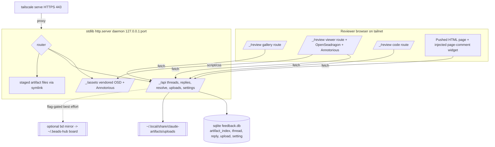

# Review app rebuild — design

Rebuild of the `artifact-serve` skill into a private, self-hosted artifact
review app. Same bones (staging-by-symlink, stdlib `http.server` + `sqlite3`
daemon, optional `tailscale serve` HTTPS, durable DB and uploads under
`~/.local/share/claude-artifacts/`, agent read-back as JSON). New review
surfaces layered on top: deep-zoom image gallery, pin-to-region annotations,
threaded resolvable comments, per-line code feedback, and an optional bd
mirror.

The working legacy script at
`.claude/skills/artifact-serve/scripts/artifact-serve.py` stays untouched
until this rebuild verifies. The rebuild lives at
`.claude/skills/artifact-serve/scripts/review-serve.py`.

## 1. Executive summary

Keep the daemon, the CLI verb surface, and the symlink staging model exactly
as they are. Replace the flat per-page comment list with a `thread` plus
`reply` model that carries an anchor (page, image region, or code line) and a
resolved flag. Deliver the rich review surfaces (OpenSeadragon deep-zoom
viewer, Annotorious pins, GitHub-style code view) as dedicated `/_/review`
app routes served from vendored static assets, while keeping the lightweight
injected comment widget for plain page-level threads. Extend the `feedback`
JSON so an agent reads back every thread with its anchor, resolved state, and
reply chain.

## 2. Context and constraints

- Backend stays stdlib only: `http.server`, `socketserver`, `sqlite3`, the
  in-house multipart parser. No new Python dependency, no build pipeline.
- Frontend uses vendored static OpenSeadragon and Annotorious files served by
  the daemon. No bundler, no npm, no DZI tiling step.
- Single-user trust model over a private tailnet. `--expose` publishes the
  whole served root read plus write to every tailnet device. No auth. This is
  a real trust boundary and the design treats stored user text as hostile.
- The legacy flat `comment` table has real rows in the wild; the migration
  must preserve them.
- CLI muscle memory is load-bearing: the verb set
  `push, unpush, start, expose, unexpose, status, stop, clean, feedback, name`
  is preserved verbatim.

## 3. Architecture



Data flow for a pin comment:

```mermaid
sequenceDiagram
  participant B as Browser (viewer route)
  participant D as Daemon
  participant DB as sqlite
  B->>B: reviewer drags a rectangle on the image (Annotorious)
  B->>D: POST /_/api/threads (anchor_kind=image_region, anchor_data=selector JSON, body, author)
  D->>D: validate anchor_data shape + size cap
  D->>DB: INSERT thread + INSERT reply (+ uploads)
  D-->>B: 201 {thread_id, reply_id}
  B->>D: GET /_/api/threads?url=...
  D->>DB: SELECT threads + replies + uploads
  D-->>B: JSON; client renders pins via Annotorious API, text via textContent
```

## 4. Pattern and technology decisions

### 4.1 Thread plus reply, two tables (chosen)

A comment thread has attributes that belong to the whole thread, not to any
single message: the anchor (where on the page or image or which code line) and
the resolved flag. Two candidate models:

- Self-referential `parent_id` on one `comment`-like table. The root row would
  have to carry anchor and resolved, and every read would walk the chain to
  find the root before it could show the anchor. Anchors and resolution are
  thread facts, not message facts, so this smears one concept across rows.
- Parent `thread` row plus flat `reply` rows (chosen). The thread row owns
  `anchor_kind`, `anchor_data`, and `resolved`. Replies are a flat, ordered
  list under a thread. GitHub inline review threads are flat (no arbitrary
  nesting), so a flat reply list is the honest shape and reads are one query
  per table with no recursion.

Decision: `thread` plus `reply`. Justification: clean home for thread-level
state, O(1) thread queries, no recursive walk, matches the GitHub inline
review mental model the UI imitates.

### 4.2 Anchor as `anchor_kind` plus `anchor_data` JSON (chosen)

One thread table serves all three review surfaces. `anchor_kind` is an enum
string (`page`, `image_region`, `code_line`); `anchor_data` is a small JSON
blob whose shape depends on the kind:

| anchor_kind    | anchor_data JSON                                                                 |
|----------------|----------------------------------------------------------------------------------|
| `page`         | `null` (whole page, same reach as today's flat comment)                          |
| `image_region` | W3C annotation selector, e.g. `{"selector": {"type": "FragmentSelector", "conformsTo": "http://www.w3.org/TR/media-frags/", "value": "xywh=pixel:100,200,50,60"}}` or an `SvgSelector` for freehand shapes |
| `code_line`    | `{"line": 42, "end_line": 47}` (`end_line` optional for single-line)             |

The `image_region` value is exactly what Annotorious emits as the `target`
selector of a W3C Web Annotation, so it round-trips: store the selector, hand
it back verbatim to `annotorious.setAnnotations(...)`, and the pin re-renders
at the same coordinates. This keeps the app agnostic to the shape kind
(rectangle vs polygon) because Annotorious owns the geometry.

### 4.3 Code feedback reuses the same store (chosen)

A code-line comment is a thread with `anchor_kind = 'code_line'` and
`anchor_data = {"line": N, "end_line": M?}`. No new table. The code view route
renders the served text file with per-line anchors and hangs threads off line
numbers, exactly as the image viewer hangs threads off regions. One store,
three anchor kinds.

### 4.4 OpenSeadragon simple-image mode, no tiling build (chosen)

OpenSeadragon can display a single full-resolution image without a DZI tile
pyramid using its `type: 'image'` tile source (the simple-image tile source).
This avoids any offline tiling build step.

- Tradeoff: the browser downloads the whole image up front and holds it in
  memory, so a very large source (for example a 200 MP export) is heavy on the
  client. Acceptable for review of mockups and renders.
- Escape hatch, not built now: if a source ships several pre-scaled sizes, the
  legacy-image-pyramid tile source (an array of `{url, width, height}` levels)
  gives progressive zoom without a DZI build. Noted for later; the skeleton
  declares the tile source in one place so upgrading is a local change.

Decision: simple-image single full-res source by default. No build pipeline.

### 4.5 Vendored assets, dedicated app routes for rich surfaces (chosen)

Two delivery options for the review UI:

- Inject the review UI into served HTML before `</body>` (today's mechanism
  for the comment widget). Fine for a small page-level comment box. Fragile
  for a deep-zoom viewer that owns the whole viewport and pulls in
  OpenSeadragon plus Annotorious CSS and JS: style and id collisions with the
  arbitrary host page, and the host page may not be an image at all.
- Dedicated app routes under `/_/review` rendered by the daemon from its own
  templates, loading vendored assets from `/_/assets/...`. Controlled DOM,
  isolated styles, viewer owns the page.

Decision (lazier robust split):

- Keep the injected comment widget for plain page-level threads on any served
  HTML page. It already works, it is backward compatible, and page-level
  threads need no viewer. Upgrade it in place to the thread model.
- Route all image-region and code-line review to dedicated pages:
  - `/_/review?artifact=<id>&path=<subdir>` gallery: thumbnail grid of image
    files under the staged artifact path.
  - `/_/review?artifact=<id>&src=<relpath>&view=image` deep-zoom viewer with
    OpenSeadragon plus the Annotorious OSD plugin for pins.
  - `/_/review?artifact=<id>&src=<relpath>&view=code` code view with per-line
    anchors and threaded comments.

A single `/_/review` entry route selects the surface by query params, so
there is one page template family to maintain.

### 4.6 Reserved path safety

Project and subdir names must match `^[a-z0-9][a-z0-9_-]*$`. The first
character class is `[a-z0-9]`, so a project literally named `_` cannot exist
(`resolve_artifact_id` rejects it before any filesystem access). Therefore the
entire `/_/...` namespace can never collide with a pushed artifact. All app
internals (assets, API, review pages) live under `/_/` and are dispatched
before the static file handler runs.

## 5. Directory and file layout

```
.claude/skills/artifact-serve/
├── SKILL.md                         # updated: new review surfaces documented
├── REFERENCE.md                     # updated: new schema, endpoints, security
├── scripts/
│   ├── artifact-serve.py            # UNTOUCHED legacy, kept until rebuild verifies
│   └── review-serve.py              # NEW app (this design's skeleton)
└── assets/                          # NEW vendored static, served under /_/assets/
    ├── openseadragon/
    │   ├── openseadragon.min.js
    │   └── images/                  # OSD nav button sprites
    └── annotorious/
        ├── annotorious-openseadragon.min.js  # core + OSD plugin, one file
        └── annotorious.min.css
```

Note: `@recogito/annotorious-openseadragon` ships its OSD build as a single
merged JS file (core plus plugin together), not two separate files. See
`assets/VENDOR.md` for the pinned version and verification.

Review page templates are inlined as module string constants in
`review-serve.py` (matching how the legacy widget JS and CSS are inlined),
so there is no separate templates directory to wire up. The vendored
Annotorious and OpenSeadragon bundles are real files (too large and binary-ish
to inline sensibly) served straight from `assets/`.

Durable storage layout is unchanged:

```
~/.local/share/claude-artifacts/
├── feedback.db          # sqlite: artifact_index, thread, reply, upload, setting
└── uploads/
    └── <reply-id>/      # was <comment-id>; new uploads keyed by reply
```

## 6. Schema DDL (full)

```sql
-- Existing, unchanged. Preserved verbatim.
CREATE TABLE IF NOT EXISTS artifact_index (
    project     TEXT NOT NULL,
    subdir      TEXT NOT NULL,
    artifact_id TEXT NOT NULL,
    src_path    TEXT NOT NULL,
    last_pushed INTEGER NOT NULL,
    PRIMARY KEY (project, subdir)
);
CREATE INDEX IF NOT EXISTS idx_index_artifact
    ON artifact_index(artifact_id);

-- Existing legacy flat comments. Kept as-is; read-only after backfill.
CREATE TABLE IF NOT EXISTS comment (
    id          INTEGER PRIMARY KEY AUTOINCREMENT,
    artifact_id TEXT NOT NULL,
    sub_path    TEXT NOT NULL DEFAULT '',
    body        TEXT NOT NULL,
    author      TEXT,
    created_at  INTEGER NOT NULL
);
CREATE INDEX IF NOT EXISTS idx_comment_artifact_path
    ON comment(artifact_id, sub_path);

CREATE TABLE IF NOT EXISTS setting (
    key   TEXT PRIMARY KEY,
    value TEXT NOT NULL
);

-- NEW: a comment thread anchored somewhere on a page.
CREATE TABLE IF NOT EXISTS thread (
    id          INTEGER PRIMARY KEY AUTOINCREMENT,
    artifact_id TEXT NOT NULL,
    sub_path    TEXT NOT NULL DEFAULT '',
    -- 'page' | 'image_region' | 'code_line'
    anchor_kind TEXT NOT NULL DEFAULT 'page',
    -- JSON: W3C selector for image_region, {line,end_line} for code_line,
    -- NULL for page. Shape validated + size capped server-side before insert.
    anchor_data TEXT,
    resolved    INTEGER NOT NULL DEFAULT 0,   -- 0 = open, 1 = resolved
    author      TEXT,                         -- thread opener, may be NULL
    created_at  INTEGER NOT NULL,
    -- optional bd mirror ticket id; NULL unless bd_mirror setting is on
    bd_ticket   TEXT,
    CHECK (anchor_kind IN ('page', 'image_region', 'code_line')),
    CHECK (resolved IN (0, 1))
);
CREATE INDEX IF NOT EXISTS idx_thread_artifact_path
    ON thread(artifact_id, sub_path);

-- NEW: a message within a thread (the thread's first reply is the opener).
CREATE TABLE IF NOT EXISTS reply (
    id         INTEGER PRIMARY KEY AUTOINCREMENT,
    thread_id  INTEGER NOT NULL REFERENCES thread(id) ON DELETE CASCADE,
    body       TEXT NOT NULL,
    author     TEXT,
    created_at INTEGER NOT NULL
);
CREATE INDEX IF NOT EXISTS idx_reply_thread ON reply(thread_id);

-- Uploads now attach to a reply. The migration rebuilds this table once to
-- make comment_id nullable and add reply_id; new uploads set reply_id only.
CREATE TABLE IF NOT EXISTS upload (
    id          INTEGER PRIMARY KEY AUTOINCREMENT,
    reply_id    INTEGER REFERENCES reply(id) ON DELETE CASCADE,
    comment_id  INTEGER,        -- legacy, nullable, populated only on old rows
    filename    TEXT NOT NULL,
    stored_path TEXT NOT NULL,
    mime        TEXT,
    size        INTEGER NOT NULL,
    created_at  INTEGER NOT NULL
);
CREATE INDEX IF NOT EXISTS idx_upload_reply ON upload(reply_id);
CREATE INDEX IF NOT EXISTS idx_upload_comment ON upload(comment_id);
```

## 7. Migration (chosen: additive tables plus one-time idempotent backfill)

The old flat `comment` table has real rows. Two options were on the table:

- Additive only: leave old rows in `comment`, read them through a union or
  view that surfaces each as a page-level single-comment thread. No data
  movement, but the read path forks forever (every reader unions two shapes).
- Additive tables plus a one-time idempotent backfill (chosen): create the
  new tables, then copy each legacy `comment` row into one page-level `thread`
  plus one `reply`, remap its uploads to that reply, and stamp a schema
  version so the copy never runs twice. After backfill there is a single read
  path: everything is a thread.

Decision: additive plus one-time idempotent backfill. Justification: a single
read path is worth one bounded copy; legacy rows become first-class threads
(page-level, resolved = 0) with nothing lost; idempotency is guaranteed by the
`schema_version` setting gate inside a transaction.

Backfill steps (run once, gated by `setting['schema_version'] < 2`, all in one
transaction):

1. Ensure the new `thread` and `reply` tables and the extended `upload` table
   exist (`CREATE TABLE IF NOT EXISTS`).
2. Rebuild `upload` once so `comment_id` is nullable and `reply_id` exists:
   create `upload_new` with the new shape, copy old rows carrying
   `comment_id`, drop `upload`, rename `upload_new` to `upload`, recreate
   indexes. (sqlite cannot drop a NOT NULL constraint in place, so a one-time
   table rebuild is the standard move.)
3. For each legacy `comment` row (ordered by `id`): insert a `thread`
   (`anchor_kind='page'`, `anchor_data=NULL`, `resolved=0`, same
   `artifact_id`, `sub_path`, `author`, `created_at`); insert a `reply`
   (same `body`, `author`, `created_at`); update every `upload` row with that
   `comment_id` to also set `reply_id` to the new reply's id.
4. Set `setting['schema_version'] = '2'`.
5. Commit.

The legacy `comment` table is left in place (read-only) as an audit trail; the
app never reads it again after backfill.

## 8. Extended `feedback --artifact <id>` JSON

Still a single JSON dump for agent consumption, now thread-shaped. Backward
friendly: a flattened `comments` array is still emitted (derived from
page-level threads' replies) for any old consumer, and a new canonical
`threads` array carries the full model.

```json
{
  "artifact_id": "cool-beaming-rivest-cd9eb3",
  "pushes": [
    {
      "project": "bhwf",
      "subdir": "mockups",
      "src_path": "/home/nikki/Git/bhwf/mockups",
      "last_pushed": 1690000000,
      "last_pushed_iso": "2026-07-22T16:25:49Z"
    }
  ],
  "threads": [
    {
      "id": 12,
      "sub_path": "gallery/hero.png",
      "anchor_kind": "image_region",
      "anchor": {
        "selector": {
          "type": "FragmentSelector",
          "conformsTo": "http://www.w3.org/TR/media-frags/",
          "value": "xywh=pixel:100,200,50,60"
        }
      },
      "resolved": false,
      "author": "nikki",
      "created_at": 1690000000,
      "created_at_iso": "2026-07-22T16:25:49Z",
      "bd_ticket": null,
      "replies": [
        {
          "id": 30,
          "body": "the eye highlight is too hot here",
          "author": "nikki",
          "created_at": 1690000000,
          "created_at_iso": "2026-07-22T16:25:49Z",
          "uploads": [
            {
              "id": 5,
              "filename": "ref.png",
              "stored_path": "/home/.../uploads/30/ref.png",
              "mime": "image/png",
              "size": 40213,
              "created_at": 1690000005,
              "created_at_iso": "2026-07-22T16:25:54Z"
            }
          ]
        },
        {
          "id": 31,
          "body": "agreed, dropping exposure",
          "author": "claude",
          "created_at": 1690000600,
          "created_at_iso": "2026-07-22T16:35:49Z",
          "uploads": []
        }
      ]
    },
    {
      "id": 13,
      "sub_path": "src/game/combat.gd",
      "anchor_kind": "code_line",
      "anchor": { "line": 42, "end_line": 47 },
      "resolved": true,
      "author": "nikki",
      "created_at": 1690001000,
      "created_at_iso": "2026-07-22T16:43:20Z",
      "bd_ticket": "bh-88",
      "replies": [
        {
          "id": 40,
          "body": "this loop reallocates every frame",
          "author": "nikki",
          "created_at": 1690001000,
          "created_at_iso": "2026-07-22T16:43:20Z",
          "uploads": []
        }
      ]
    }
  ],
  "comments": [
    {
      "id": 30,
      "thread_id": 12,
      "sub_path": "gallery/hero.png",
      "body": "the eye highlight is too hot here",
      "author": "nikki",
      "created_at": 1690000000,
      "created_at_iso": "2026-07-22T16:25:49Z",
      "resolved": false,
      "uploads": [ { "id": 5, "filename": "ref.png", "size": 40213, "mime": "image/png" } ]
    }
  ]
}
```

Notes:

- `anchor` is the parsed `anchor_data` (not the raw string), or `null` for a
  page thread.
- `resolved` is a real JSON boolean.
- `threads` is the canonical shape agents should read; `comments` is a
  deprecated flat convenience derived from thread replies.

## 9. API endpoints

Existing `/_/api/uploads/<id>` and `/_/api/settings` are unchanged. New and
changed endpoints:

| Method | Path                              | Request body                                                                                                                                | Response                                                                                     |
|--------|-----------------------------------|---------------------------------------------------------------------------------------------------------------------------------------------|----------------------------------------------------------------------------------------------|
| GET    | `/_/api/threads?url=<page-url>`   | none (also accepts `?artifact=<id>&sub_path=<p>`)                                                                                            | `{artifact_id, sub_path, threads: [ {id, anchor_kind, anchor, resolved, author, created_at, created_at_iso, replies:[...]} ]}` |
| POST   | `/_/api/threads`                  | multipart/form-data: `url` OR `artifact` (+ `sub_path`), `anchor_kind`, `anchor_data` (JSON string, omit/empty for page), `body` (req), `author` (opt), `files` (opt, multi) | `201 {thread_id, reply_id, artifact_id, sub_path, anchor_kind, uploads:[...]}`               |
| POST   | `/_/api/threads/<id>/replies`     | multipart/form-data: `body` (req), `author` (opt), `files` (opt, multi)                                                                      | `201 {reply_id, thread_id, uploads:[...]}`                                                    |
| POST   | `/_/api/threads/<id>/resolve`     | JSON `{resolved: true|false}`; if omitted, toggles                                                                                           | `200 {id, resolved}`                                                                          |
| GET    | `/_/api/uploads/<id>`             | none (unchanged)                                                                                                                            | upload bytes; inline for images/PDF, attachment otherwise                                    |
| GET    | `/_/api/settings`                 | none (unchanged)                                                                                                                            | `{key: value, ...}`                                                                           |

Legacy `/_/api/comments` (GET and POST) is kept as a thin shim: GET returns
page-level threads flattened to the old comment shape; POST creates a
page-level thread. This keeps any cached legacy widget working during
transition. New clients use `/_/api/threads`.

Review page routes (server-rendered HTML, not JSON):

| Method | Path                                                       | Purpose                                              |
|--------|------------------------------------------------------------|------------------------------------------------------|
| GET    | `/_/review?artifact=<id>&path=<subdir>`                    | gallery grid of images under the staged artifact path |
| GET    | `/_/review?artifact=<id>&src=<relpath>&view=image`         | OpenSeadragon deep-zoom viewer + Annotorious pins     |
| GET    | `/_/review?artifact=<id>&src=<relpath>&view=code`          | code view with per-line anchors + threads             |
| GET    | `/_/assets/<rel>`                                          | vendored OpenSeadragon / Annotorious static files     |

## 10. Security

The trust boundary is unchanged in shape (single-user private tailnet, no
auth, `--expose` publishes read plus write to the whole tailnet) but the
attack surface grows because more user-authored text is stored and re-rendered.
Defenses:

### 10.1 Stored XSS in comment bodies and author names

Every reply body and author name is reviewer-supplied and is rendered back into
served HTML. Rules the implementation must follow:

- Client render path: assign all user strings via `element.textContent` or
  `document.createTextNode`, never `innerHTML` with a user string. This is how
  the legacy widget already renders bodies; keep it and apply it to author,
  reply bodies, and any anchor label.
- Server render path: any place the daemon embeds a user string into an HTML
  template (for example an author name printed into a server-rendered review
  page) is passed through `html.escape(value, quote=True)` first.
- Data delivery: user content travels to the browser as JSON via `fetch`, then
  is placed with `textContent`. JSON is never interpolated into a `<script>`
  block as a literal.

### 10.2 Annotorious selector validation

`anchor_data` arrives from the client as a JSON string and must not be trusted
as an arbitrary blob. Server-side validation before any insert:

- Size cap: reject `anchor_data` longer than `MAX_ANCHOR_BYTES`
  (8 KB) with 400.
- Parse: `json.loads`; reject non-JSON with 400.
- Shape by `anchor_kind`:
  - `page`: `anchor_data` must be empty/absent; stored as `NULL`.
  - `image_region`: must be an object with a `selector` object whose `type` is
    one of `FragmentSelector` or `SvgSelector`.
    - `FragmentSelector`: `value` must match a strict media-fragment regex
      (`^xywh=(pixel:|percent:)?\d+(\.\d+)?,\d+(\.\d+)?,\d+(\.\d+)?,\d+(\.\d+)?$`).
    - `SvgSelector`: `value` must be a string capped in length; stored as an
      opaque validated string and only ever handed back to the Annotorious
      client API (`setAnnotations`), never assigned to `innerHTML`. Residual
      risk (an SVG payload echoed into the DOM by future code) is documented,
      not deeply sanitized; the mitigation is the strict never-innerHTML rule.
  - `code_line`: must be an object with integer `line` >= 1 and optional
    integer `end_line` >= `line`. Reject anything else.
- Store the re-serialized validated JSON, not the raw bytes, so unexpected
  extra keys are dropped.

### 10.3 Preserved upload defenses (do not regress)

- Extension allowlist and blocklist unchanged. `.svg`, `.html`, `.js` and the
  rest stay hard-blocked, which also closes SVG-upload XSS.
- 100 MB per file, 500 MB per request caps unchanged.
- Filename sanitize (basename only, non `[A-Za-z0-9._-]` collapsed, leading
  dots stripped, 200 char cap) unchanged.
- Upload serving forces `attachment` disposition for non-image, non-PDF types,
  unchanged.

### 10.4 Symlink and traversal posture (unchanged)

- Staged entries stay symlinks; symlink targets are intentionally not
  sandboxed (you pushed it). Push narrowly.
- URL traversal is blocked by `SimpleHTTPRequestHandler.translate_path`
  normalization. The new `src` query param on review routes must be resolved
  under the staged artifact root and rejected if it escapes (path
  normalization plus an `is_relative_to` check on the resolved real path).

### 10.5 CSRF (unchanged, called out)

No CSRF token. On a single-user private tailnet a malicious page could trick
the reviewer's browser into POSTing a comment. Low risk for single-user;
documented. If this ever serves a multi-user tailnet, add a token.

## 11. Optional bd mirror (flag-gated, never a hard dependency)

A setting `bd_mirror` (`'1'` to enable, absent/`'0'` off) gates mirroring each
thread into a bd ticket on the `~/.beads-hub` board so agents can query review
feedback as tickets.

- The app never imports bd and never hard-depends on it. Mirroring is a
  best-effort `subprocess` call to the `bd` CLI.
- If `bd_mirror` is off, or `shutil.which("bd")` is `None`, mirroring is a
  silent no-op. It is never an error and never blocks the comment write.
- On thread create: if enabled, `bd create` a ticket titled from the thread
  (artifact, sub_path, anchor summary, first reply body), capture the returned
  ticket id, and store it on `thread.bd_ticket`.
- On reply: if the thread has a `bd_ticket`, append the reply as a bd comment
  (best effort).
- On resolve toggle: if the thread has a `bd_ticket`, close/reopen the ticket
  (best effort).
- Every bd call is wrapped so any failure logs a warning and returns; the HTTP
  response to the reviewer is unaffected.
- A `mirror` CLI subverb is intentionally NOT added; the flag plus the write
  hooks are enough. `bd_mirror` is toggled through the existing `setting`
  table (a small extension to the `name` verb or a direct setting write).

## 12. Trade-offs and risks

| Decision                         | Benefit                                   | Cost / risk                                             |
|----------------------------------|-------------------------------------------|---------------------------------------------------------|
| thread + reply two tables        | clean thread-level state, no recursion    | two inserts to open a thread                            |
| one-time backfill migration      | single read path                          | one table rebuild of `upload`; must be transactional    |
| OSD simple-image, no tiling      | zero build pipeline                        | whole-image download, heavy for very large sources      |
| dedicated `/_/review` routes     | isolated viewer, no host-page collisions   | more server-rendered templates than pure injection      |
| vendored assets                  | offline, no npm, deterministic             | manual refresh to update OSD/Annotorious versions       |
| flag-gated bd mirror             | agent-queryable without hard dep           | best-effort, can silently drift from DB if bd errors    |

## 13. Validation approach

- Legacy verbs (`push, unpush, start, expose, unexpose, status, stop, clean,
  feedback, name`) behave identically to the old script on a fresh DB and on a
  DB carrying legacy `comment` rows.
- Migration idempotency: run the daemon twice against a DB with legacy
  comments; assert thread/reply counts do not double and `schema_version` is
  `'2'`.
- Anchor validation: reject oversize `anchor_data`, malformed selectors,
  non-integer code lines; accept a real Annotorious FragmentSelector payload.
- XSS: post a reply body and author of ``; confirm
  it renders as literal text in the viewer and code pages and is `html.escape`d
  anywhere server-embedded.
- OSD viewer loads a large PNG via simple-image and pins round-trip: create a
  region thread, reload, pin re-renders at the same coordinates.
- bd mirror: with `bd_mirror` on and `bd` absent, posting a comment still
  returns 201 and logs a no-op.

## 14. Open questions

- Should resolved threads be hidden by default in the viewer (with a toggle) or
  always shown greyed? Default proposed: shown greyed with a filter toggle.
- Author identity is still free-text (no login). Fine for single-user; note if
  multi-reviewer ever matters.
- bd mirror ticket title format and board path (`~/.beads-hub`) assume the
  orchestration doctrine board; confirm the exact `bd` invocation for that hub.
